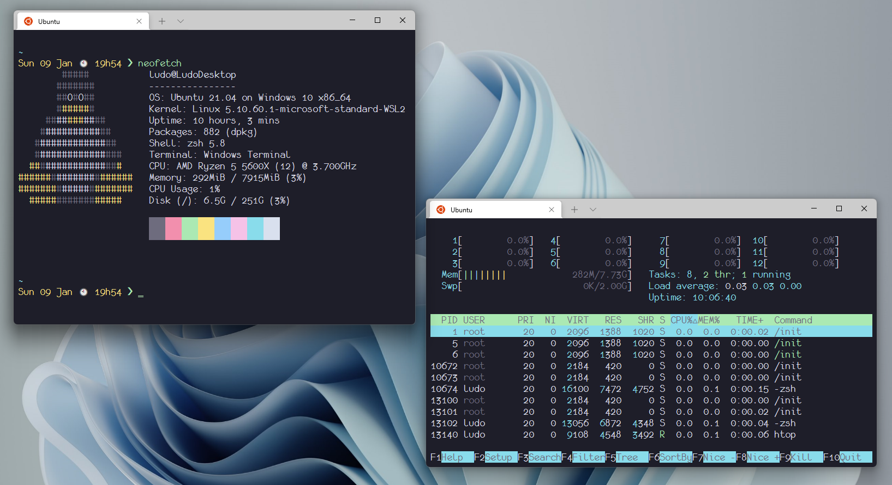

<h3 align="center">
	<br/>
	
	Catppuccin for <a href="https://github.com/Microsoft/Terminal">Windows Terminal</a>
	
</h3>

<p align="center">
    <a href="https://github.com/catppuccin/windows-terminal/stargazers"></a>
    <a href="https://github.com/catppuccin/windows-terminal/issues"></a>
    <a href="https://github.com/catppuccin/windows-terminal/contributors"></a>
</p>

<p align="center">
  
</p>

## Usage

1. Launch Windows Terminal
2. Open the **Settings** panel (<kbd>Ctrl + ,</kbd>)
3. Select **Open JSON file** at bottom left corner (<kbd>Ctrl + Shift + ,</kbd>)
4. Choose your _flavour_ (frappe, latte, macchiato, mocha)
5. Copy the contents of _flavour_.json (example: frappe.json) into the opened JSON file under **"schemes"**:

```json
{
    ..default layout
    "schemes":
    [
        ..catppuccin flavour
        ..other schemes
    ],
}
```

6. Copy the contents of _flavourTheme_.json (example: frappeTheme.json) into the opened JSON file under **"themes"**:

```json
{
    ..default layout
    "themes":
    [
        ..catppuccin flavour
        ..other themes
    ],
}
```

7. Save and exit
8. In the **Settings** panel under Profiles, select the profile you want to apply the theme to. **Defaults** will apply theme to all profiles.
9. Select **Appearance**
10. Choose your _catppuccin flavor_ in the **Color scheme** drop down menu 
11. Click on **Save**, enjoy! ✨

## 💝 Thanks to

- [Pocco81](https://github.com/Pocco81)
- [LudoPinelli](https://github.com/LudoPinelli)
- [AdalZanabria](https://github.com/AdalZanabria)
- [Aryan Prince](https://github.com/aryanprince)

&nbsp;

<p align="center"></p>
<p align="center">Copyright &copy; 2021-present <a href="https://github.com/catppuccin" target="_blank">Catppuccin Org</a>
<p align="center"><a href="https://github.com/catppuccin/catppuccin/blob/main/LICENSE"></a></p>
